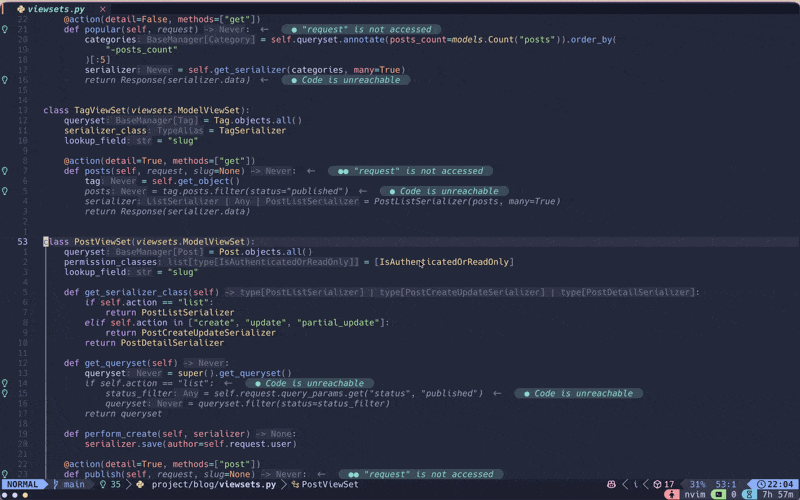
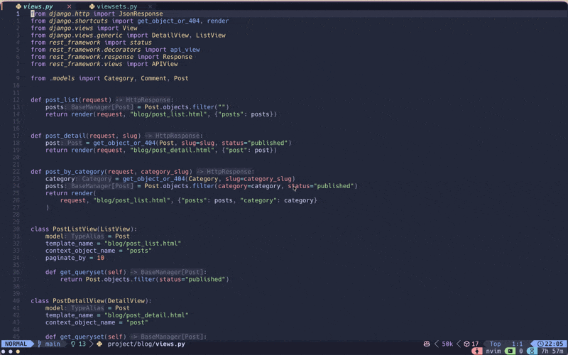

# django.nvim

Django utilities for Neovim.

## Requirements

This plugin requires `django-types` to be installed in your Django project for type hints and autocompletion to work properly.

Install it using uv:

```bash
uv add --dev django-types
```

Or using pip:

```bash
pip install django-types
```

Or add it to your project's dependencies:

```toml
# pyproject.toml
[project]
dependencies = [
    "django-types>=0.19.0",
]
```

## Installation

Using [lazy.nvim](https://github.com/folke/lazy.nvim):

```lua
{
  "mizisu/django.nvim",
  dependencies = {
    { "folke/snacks.nvim" },
    {
      "saghen/blink.cmp",
      optional = true,
      opts = {
        sources = {
          default = { "django" },
          providers = {
            django = {
              name = "Django",
              module = "django.completions.blink",
              async = true,
            },
          },
        },
      },
    },
  },
  config = function()
    require("django").setup({
      -- Default configuration
      -- views = {
      --   auto_refresh = {
      --     on_picker_open = true,
      --     file_watch_patterns = {
      --       "*/urls.py",
      --       "*/views.py",
      --       "*/view.py",
      --       "*/*views.py",
      --       "*/*view.py",
      --       "*/*viewset.py",
      --       "*/*view_set.py",
      --       "*/*api.py",
      --     },
      --   },
      -- },
      -- models = {
      --   auto_refresh = {
      --     on_picker_open = true,
      --     file_watch_patterns = { "*/models.py", "*/models/*.py" },
      --   },
      -- },
      -- shell = {
      --   command = "shell",  -- "shell", "shell_plus", "shell_plus --ipython", etc.
      --   position = "right", -- "bottom", "top", "left", "right", "float"
      --   env = {},           -- { DJANGO_SETTINGS_MODULE = "myproject.settings" }
      -- },
    })
  end,
}
```

## Features

### Django Views Explorer

Quickly browse and navigate through all URL patterns in your Django project.

- View all views with URL patterns, view names, and file locations at a glance
- Jump directly to the exact code location when selecting a view



### Django Models Browser

Search and explore all Django models in your project.

- Display model name, app label, and field count
- Navigate directly to model class definitions
- Sorted by app for easy project structure understanding



### Django ORM Autocompletion (Blink.cmp)

Intelligent autocompletion for Django QuerySet methods with full type awareness.

**Features:**

- **Field Completions**: Autocomplete model fields based on LSP type information
- **Relation Traversal**: Navigate relationships with `__` syntax (e.g., `author__username`)
- **Lookup Operators**: Field type-aware lookups (e.g., `title__icontains`, `created_at__gte`)


### Django Shell

Open Django's interactive shell directly from Neovim using Snacks.nvim terminal.

**Features:**

- Toggle shell with a single keymap
- Send selected code from visual mode

**Usage:**

```lua
-- In normal mode: toggle shell
<leader>djs

-- In visual mode: send selected code to shell
<leader>djs
```

### Refresh

Automatically or manually refresh data.

- Auto-refresh on file save
- Customizable file pattern watching
- Refresh when opening picker

### Commands

| Command | Description |
|---------|-------------|
| `:DjangoViews` | Browse Django views |
| `:DjangoViewsRefresh` | Refresh views data |
| `:DjangoModels` | Browse Django models |
| `:DjangoModelsRefresh` | Refresh models data |
| `:DjangoCompletionsRefresh` | Refresh completions data |
| `:DjangoRefreshAll` | Refresh all data |
| `:DjangoClearAllCache` | Clear all cached data |
| `:DjangoShell` | Toggle Django shell |
| `:DjangoShellClose` | Close Django shell |

### Default Keymaps

| Keymap | Description |
|--------|-------------|
| `<leader>djv` | Browse Django views |
| `<leader>djm` | Browse Django models |
| `<leader>djr` | Refresh all data |
| `<leader>djc` | Clear all cached data |
| `<leader>djs` | Toggle Django shell (normal) / Send selection (visual) |

### Picker Keybindings

- `<C-r>`: Refresh data within the picker
- All standard Snacks.nvim picker keybindings apply

## License

MIT
